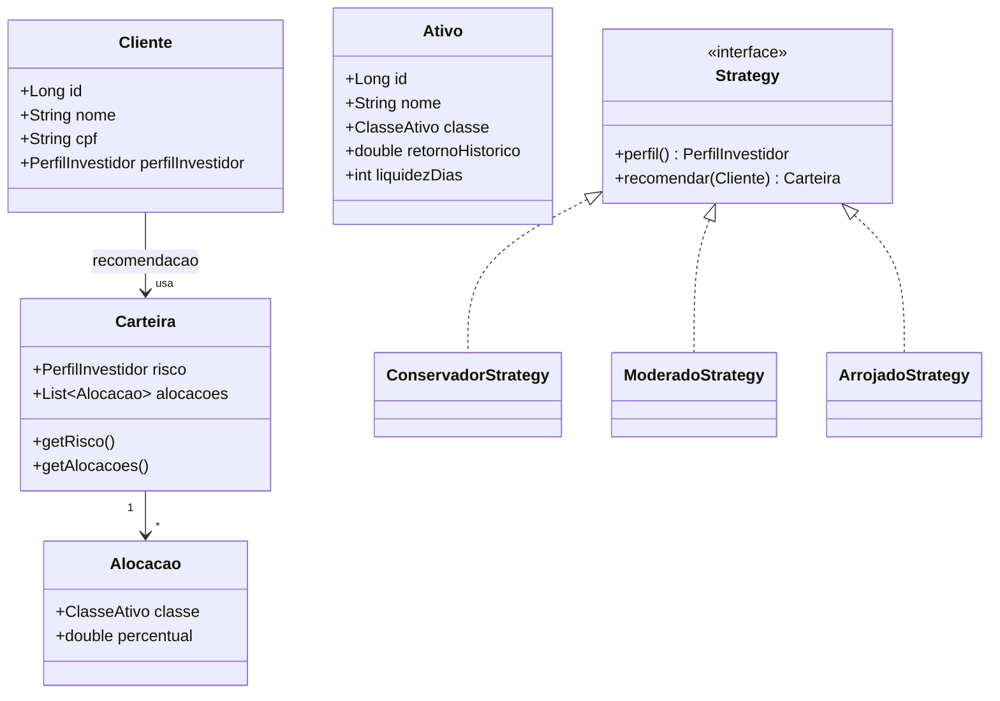

# Arquitetura e Diagramas — AcessorXPSOA

Este documento consolida os **diagramas de arquitetura**, **modelo de entidades** e **casos de uso** do projeto.

## 1) Arquitetura em Camadas
```mermaid
flowchart TB
    subgraph Presentation [Camada de Apresentação (REST)]
        A1[AtivoController]
        A2[ClienteController]
        A3[RecomendacaoController]
        GH[GlobalExceptionHandler \n (@RestControllerAdvice)]
        OA[Swagger UI / OpenAPI]
    end

    subgraph Application [Camada de Aplicação (Serviços)]
        S1[AtivoService]
        S2[ClienteService]
        S3[RecomendacaoService]
        SF[StrategyFactory]
        SC[ConservadorStrategy]
        SM[ModeradoStrategy]
        SA[ArrojadoStrategy]
        XAI[XAIUtil]
    end

    subgraph Infrastructure [Infraestrutura]
        R1[(AtivoRepository)]
        R2[(ClienteRepository)]
        FW[Flyway Migrations]
        H2[(H2 Database - Memória)]
        JPA[JPA/Hibernate]
    end

    A1 --> S1
    A2 --> S2
    A3 --> S3

    S1 --> R1 --> JPA --> H2
    S2 --> R2 --> JPA --> H2

    S3 --> SF
    SF --> SC
    SF --> SM
    SF --> SA
    S3 --> XAI
    S3 -.consulta clientes/ativos.-> S1
    S3 -.consulta clientes.-> S2

    FW --> H2
    OA --> A1
    OA --> A2
    OA --> A3
    GH --- A1
    GH --- A2
    GH --- A3
```
**Notas:**
- **Controllers** expõem endpoints REST e validam entrada.
- **Services** orquestram regras de negócio e transações.
- **Repositories** isolam persistência com Spring Data JPA.
- **Flyway** versiona o schema; **H2** é a base em memória.
- **StrategyFactory** resolve a estratégia por perfil e **XAIUtil** gera explicações.

## 2) Componentes (C4-ish)
```mermaid
flowchart LR
    Client[Cliente HTTP\n(Postman/Swagger/cURL)] --> API[Spring Boot API]
    subgraph API
      Controllers[Controllers REST] --> Services[Services]
      Services --> Repositories[JPA Repositories]
      Services --> Strategy[StrategyFactory + Strategies]
      Services --> XAI[XAIUtil]
      Controllers --> Advice[GlobalExceptionHandler]
    end
    Repositories --> DB[(H2)]
    Migrations[Flyway] --> DB
    Docs[OpenAPI/Swagger UI] --> Controllers
```

## 3) Modelo de Entidades (ER)
```mermaid
erDiagram
    CLIENTES {
        BIGINT id PK
        VARCHAR nome
        VARCHAR cpf UNIQUE
        VARCHAR perfil
    }
    ATIVOS {
        BIGINT id PK
        VARCHAR nome
        VARCHAR classe
        DOUBLE retorno_historico
        INT liquidez_dias
    }

    %% Relacionamentos diretos não persistidos (recomendação usa VO):
    CLIENTES ||--o{ RECOMENDACAO : "gerada em runtime (VO)"
```
> **Recomendação** (Carteira/Alocacao) é **VO**, não entidade — não persiste em banco.

## 4) Diagrama de Classes (UML simplificado — domínio)


## 5) Casos de Uso (serviços expostos)
```mermaid
flowchart TB
    actor[Usuário API\n(Postman/Swagger)]
    subgraph UC[Casos de Uso]
      UC1((CRUD Ativos))
      UC2((CRUD Clientes))
      UC3((Gerar Recomendação))
    end

    actor --> UC1
    actor --> UC2
    actor --> UC3

    UC1 -->|POST /api/ativos| A
    UC1 -->|GET/PUT/DELETE /api/ativos/{id}| A2
    UC2 -->|POST /api/clientes| B
    UC2 -->|GET/PUT/DELETE /api/clientes/{id}| B2
    UC3 -->|POST /api/recomendacoes| C
```
**Fluxo de Recomendação:**
1. Cliente existe com `perfilInvestidor` definido.
2. `POST /api/recomendacoes { clienteId }`
3. Service resolve estratégia por perfil → monta `Carteira` e `Alocacoes`.
4. `XAIUtil` explica a recomendação.
5. Retorna `RecomendacaoResponse`.

## 6) Observações de qualidade
- Métodos nos Services são transacionais e coesos (`criar`, `atualizar`, `listar`, `deletar`).
- Controllers padronizam `ResponseEntity` e validações `@Valid`/`@Validated`.
- Handler global entrega erros consistentes (400/404/409/500).
- Migrations versionam todas as mudanças de schema.

---
**Gerado em:** 2025-09-20T18:59:10
